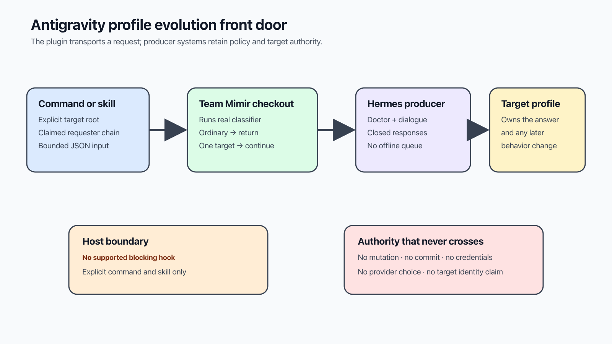

# Use Hermes Profile Evolution in Antigravity

This plugin is the Antigravity front door for proposing a change to one Team
Mimir profile. It has a command and a skill, but no blocking hook.



## Install and verify

From this repository:

```bash
./tools/install-plugin.sh install hermes-profile-evolution
python3 -c 'import json, pathlib; print(json.loads(pathlib.Path("plugins/hermes-profile-evolution/plugin.json").read_text())["version"])'
uv run python scripts/validate_plugins.py
```

The released manifest version is `0.1.2`. Restart Antigravity after installing
or changing the plugin link.

Set the two independent roots once. The first is the target Team Mimir checkout;
the second is the installed adapter:

```bash
TEAM_MIMIR_ROOT=/path/to/team-mimir
PROFILE_ADAPTER="${AGY_PLUGIN_ROOT:-$HOME/.gemini/config/plugins/hermes-profile-evolution}/scripts/profile_request.py"
```

## Start a request

```bash
python3 "$PROFILE_ADAPTER" --team-mimir-root "$TEAM_MIMIR_ROOT" request <<'JSON'
{
  "target": "brokkr",
  "requester": {"actor_kind": "operator", "actor_id": "operator", "verification": "claimed"},
  "delegation_chain": [
    {"actor_kind": "harness", "actor_id": "antigravity", "verification": "claimed"}
  ],
  "intent": "Consider refining your review preference.",
  "evidence_references": ["docs/proposal.md"],
  "paths": ["profiles/brokkr/SOUL.md"]
}
JSON
```

The target must match the single profile owner returned by Team Mimir. The
requester and delegation chain identify who asked and which harness carried the
request. Neither can claim the target's verified identity.

## Continue or inspect dialogue

Use the exact canonical envelope returned by the request:

```bash
printf '%s' '{"envelope":<proposal-envelope>,"message":"Please explain the tradeoff."}' \
  | python3 "$PROFILE_ADAPTER" reply

printf '%s' '<proposal-envelope>' \
  | python3 "$PROFILE_ADAPTER" resume

printf '%s' '{"proposal_id":"proposal-0123456789abcdef","revision":"<64-character-revision-digest>","target":"brokkr"}' \
  | python3 "$PROFILE_ADAPTER" status

printf '%s' '{"target":"brokkr"}' \
  | python3 "$PROFILE_ADAPTER" doctor
```

`doctor` checks the canonical Hermes route, credentials, service, and target
response. The adapter also supports the producer-owned `census` action; see the
skill for its closed input contract.

## Boundary and failures

Antigravity has no proven native blocking-hook contract in this repository.
The `/hermes-profile-evolution` command and skill guide the operator, but they
do not intercept edits made another way.

The adapter exits `0` after a validated result and `2` for malformed or
secret-bearing input, failed classification, cross-target requests, unavailable
or incompatible Hermes service, contract drift, or malformed producer output.
Stop on exit `2`; do not replace the request with a direct profile edit.

## Privacy

Send repository-relative paths, concise intent, and sanitized repository
references. Do not send credentials, tokens, endpoints, private runtime paths,
logs, sessions, transcripts, databases, models, providers, system prompts, or
tool overrides. Proposal content travels as bounded JSON on standard input.

The [Team Mimir operator hub](https://github.com/infiquetra/team-mimir/tree/main/docs/team/profile-evolution)
explains custody and activation. The
[Hermes producer contract](https://github.com/infiquetra/infiquetra-hermes-plugins/tree/main/docs/profile-evolution)
defines canonical dialogue and compatibility.
