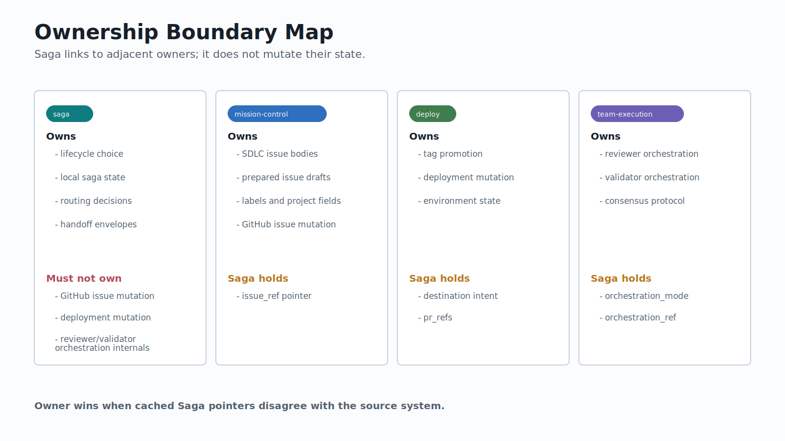

# Saga Boundaries

Saga owns lifecycle state and routing. It does not own adjacent systems' mutation surfaces.

## Ownership Map

| Owner | Owns | Saga holds |
|-------|------|------------|
| `saga` | lifecycle choice, local saga state, routing decisions, handoff envelopes | its own append-only ticks |
| `mission-control` | issue bodies, prepared issue drafts, labels, project fields, GitHub issue mutation | `issue_ref` pointer |
| `deploy` | tag promotion, deployment mutation, environment state | destination intent and PR refs |
| `team-execution` | reviewer orchestration, validator orchestration, consensus protocol | `orchestration_mode` and `orchestration_ref` |

When Saga's cached pointer disagrees with the source system, the source system wins. Git owns branches and commits. GitHub owns PR state. `mission-control` owns SDLC issue state. `deploy` owns environment state.

## Hard Negatives

Saga must not create SDLC issue bodies directly. It prepares handoff context and routes to `mission-control`.

Saga must not promote tags, mutate environments, or run canaries. It records destination intent and routes deployment mutation to `deploy`.

Saga must not absorb reviewer/validator orchestration internals. It records the selected backend and calls or routes to the owner.

Saga must not treat off-chain command names as stored lifecycle phases.

## Claude Saga And Codex Saga

Claude Saga is the source surface for this repository. The Codex port is an adapter example that preserves the lifecycle semantics while changing host mechanics.

| Dimension | Claude Saga in this repo | Codex Saga adapter |
|-----------|--------------------------|--------------------| 
| Command surface | 18 command files, 17 routable commands, `/ceo-review` alias | ported command family may omit or adapt host-only surfaces |
| State root | `.gemini/saga/` | host-specific local state root |
| Backend availability | `inline`, `team-execution`, source workflow backend where available | `inline` and `team-execution` in Codex; source workflow backend omitted |
| Durable docs | repo `docs/*` artifacts plus plugin manual | same lifecycle artifact idea, host-adapted paths |
| Invariant semantics | stored axes, derived maturity, routing ownership, handoff boundaries | preserved |

Use Codex-port docs as comparative evidence, not as replacement truth for Claude Saga.
