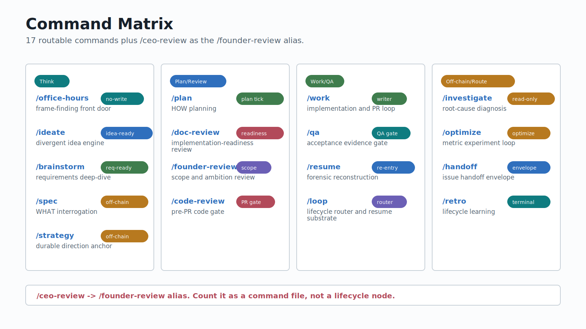

# Saga Command Selection

Saga has 18 command files and 17 routable commands. `/ceo-review` is an alias for `/founder-review`, so it is documented separately but does not add a lifecycle node.

## Adjacent Command Distinctions

| Pair | Distinction |
|------|-------------|
| `/office-hours` vs `/ideate` | `/office-hours` finds the frame; `/ideate` generates options inside a usable frame. |
| `/ideate` vs `/brainstorm` | `/ideate` produces and critiques many ideas; `/brainstorm` deepens one chosen idea into requirements. |
| `/brainstorm` vs `/spec` | `/brainstorm` explores requirements and approaches; `/spec` interrogates an ambiguous WHAT until it is precise. |
| `/plan` vs `/doc-review` | `/plan` writes implementation units and decisions; `/doc-review` checks whether that plan is ready to execute. |
| `/qa` vs `/optimize` | `/qa` gates a shipped or merge-bound change; `/optimize` loops toward a metric target. |
| `/strategy` vs `/founder-review` | `/strategy` records direction; `/founder-review` challenges ambition, scope, and timing. |
| `/loop` vs `/resume` | `/loop` routes from current state; `/resume` reconstructs a confusing or cold thread in depth. |

## Command Cards

### /office-hours

Frame-finding front door for early, vague, or stage-sensitive work.

| Field | Value |
|-------|-------|
| Purpose | Find the right frame before selecting a lifecycle command. |
| Use when | The problem, stage, assumptions, or next artifact are unclear. |
| Do not use when | The WHAT is settled enough for requirements or planning, or the user is asking for implementation. |
| Inputs | Topic, early ask, vague business or builder problem. |
| Outputs | Optional `docs/office-hours/` note plus route to `/ideate`, `/brainstorm`, `/plan`, or `/strategy`. |
| Saga state | Does not write saga state directly; `/loop` may tick routing around it. |
| Routes in | cold-start vague ask, `/loop`. |
| Routes out | `/ideate`, `/brainstorm`, `/plan`, `/strategy`. |
| Gates | Never implement, plan, scaffold, or file an SDLC issue. |
| Boundary | Owns frame discovery only. |
| Common mistakes | Treating it as planning; skipping it when the frame is unknown. |
| Example | `/office-hours "I have an idea but do not know what it is yet"` |

### /ideate

Divergent engine for grounded idea generation and critique.

| Field | Value |
|-------|-------|
| Purpose | Generate, critique, and surface survivor ideas. |
| Use when | The user wants possible directions or has a theme but not one selected idea. |
| Do not use when | One idea already needs requirements, or the ask needs precise WHAT interrogation. |
| Inputs | Topic, repo context, strategy context, operator seed ideas. |
| Outputs | Survivor ideas and optional `docs/ideation/` artifact. |
| Saga state | Produces idea-ready artifacts; does not store maturity in saga state. |
| Routes in | `/office-hours`, cold-start divergent ask. |
| Routes out | `/brainstorm`, `/spec`, `/plan`. |
| Gates | Preserve rejection reasons; operator seed ideas face the same critique as generated ideas. |
| Boundary | Owns divergent generation and critique, not requirements or implementation. |
| Common mistakes | Using it for a chosen idea; dropping rejected ideas without reasons. |
| Example | `/ideate "Saga documentation improvements"` |

### /brainstorm

Requirements deep-dive for one chosen idea.

| Field | Value |
|-------|-------|
| Purpose | Turn one chosen idea into a right-sized requirements-ready document. |
| Use when | A single idea is chosen but requirements and approaches need pressure-testing. |
| Do not use when | The ask is still open-ended, or the WHAT is too vague for requirements. |
| Inputs | Chosen idea, ideation survivor, or named topic. |
| Outputs | Requirements document under `docs/brainstorms/`. |
| Saga state | Produces requirements-ready artifacts; does not store maturity in saga state. |
| Routes in | `/ideate`, `/office-hours`, selected idea. |
| Routes out | `/spec`, `/plan`, `/handoff`. |
| Gates | Keep WHAT and acceptance examples clear enough for `/plan`. |
| Boundary | Owns requirements exploration, not HOW planning. |
| Common mistakes | Treating the brainstorm as an implementation plan; skipping approach tradeoffs. |
| Example | `/brainstorm docs/ideation/2026-06-09-example.md` |

### /spec

WHAT-interrogation engine for vague asks.

| Field | Value |
|-------|-------|
| Purpose | Interrogate a vague ask into a precise backlog-ready WHAT spec. |
| Use when | The ask needs five-Why, scope, MVP, non-goal, and failure-mode rigor. |
| Do not use when | The user wants many possible ideas, or the HOW is the unsettled part. |
| Inputs | Vague ask, issue reference, rough doc path. |
| Outputs | Spec artifact under `docs/specs/`. |
| Saga state | Off-chain and saga-untouched; `docs/specs/` maps to requirements-ready at handoff. |
| Routes in | vague WHAT, `/brainstorm`. |
| Routes out | `/handoff`, `/plan`, `/doc-review`. |
| Gates | Do not produce a spec after message 1; interrogate first and read code before technical questions. |
| Boundary | Owns WHAT rigor, not HOW planning or issue mutation. |
| Common mistakes | Treating `spec` as a stored lifecycle phase; filing an SDLC issue directly. |
| Example | `/spec "make Saga docs better"` |

### /plan

HOW-planning engine for settled requirements.

| Field | Value |
|-------|-------|
| Purpose | Create a durable implementation plan from requirements-ready or plan-ready context. |
| Use when | The WHAT is settled and the work needs units, decisions, and verification. |
| Do not use when | The WHAT is still vague, or the change is truly atomic. |
| Inputs | Requirements doc, issue, source artifact, or request. |
| Outputs | Plan under `docs/plans/` and a plan saga tick. |
| Saga state | Writes `lifecycle_phase=plan` with complete phase status when done. |
| Routes in | `idea-ready`, `requirements-ready`, `docs/brainstorms/`, `docs/specs/`. |
| Routes out | `/doc-review`, `/work`. |
| Gates | Does not implement or run the review gauntlet. |
| Boundary | Owns HOW planning only. |
| Common mistakes | Re-deciding product scope; skipping `/doc-review` before `/work`. |
| Example | `/plan docs/brainstorms/2026-06-09-example.md` |

### /doc-review

Implementation-readiness review for plans and requirements.

| Field | Value |
|-------|-------|
| Purpose | Review plans, requirements, or formal SDLC artifacts for readiness. |
| Use when | A document must be checked before execution, and safe in-place fixes may help. |
| Do not use when | The target is code at the PR boundary, or the question is ambition/scope. |
| Inputs | Document path. |
| Outputs | Review artifact under `docs/reviews/` and optional safe fixes. |
| Saga state | Review evidence; unresolved P0/P1 blocks `/work` unless overridden. |
| Routes in | `/plan`, optional `/spec` review. |
| Routes out | `/work`, `/plan`, `/founder-review`. |
| Gates | P0/P1 findings block `/work` without recorded override. |
| Boundary | Owns document readiness, not code review or implementation. |
| Common mistakes | Treating it as `/code-review`; ignoring unresolved P0/P1 findings. |
| Example | `/doc-review docs/plans/2026-06-09-example-plan.md` |

### /work

Implementation engine and PR loop owner.

| Field | Value |
|-------|-------|
| Purpose | Execute an approved plan to PR-ready, then own the round-N PR continuation loop. |
| Use when | A reviewed plan is ready to build, or a plan-ready/resume-ready issue should be executed. |
| Do not use when | Requirements or HOW are unsettled, or deployment mutation is the only remaining step. |
| Inputs | Plan path, plan-ready issue, resume-ready issue. |
| Outputs | Changes, work-session writeups, commits, PR coordination, saga ticks. |
| Saga state | Primary writer for `lifecycle_phase=work`, rounds, branch, checks, PR refs, work sessions. |
| Routes in | `/doc-review`, `plan-ready`, `resume-ready`. |
| Routes out | `/code-review`, `/qa`, `/handoff`. |
| Gates | Hard test gate by risk; hard review gate on P0/P1 or stale review; PR and merge require confirmation. |
| Boundary | Owns build, test, record, and PR loop; does not own deploy or issue filing. |
| Common mistakes | Starting before readiness; claiming PR-ready without fresh tests and review. |
| Example | `/work docs/plans/2026-06-09-example-plan.md` |

### /code-review

Pre-PR code-quality gate.

| Field | Value |
|-------|-------|
| Purpose | Run structured code-quality review at the work-to-PR boundary. |
| Use when | Built work needs pre-PR or PR-boundary review. |
| Do not use when | The target is a plan/requirements document, or the user wants code changes applied by the reviewer. |
| Inputs | Diff, branch, PR, or scope. |
| Outputs | Code review artifact under `docs/code-reviews/`. |
| Saga state | Appends `review_paths` to active work-thread saga when present; does not advance lifecycle phase. |
| Routes in | `/work`, PR boundary. |
| Routes out | `/work`, PR-ready. |
| Gates | P0/P1 findings block PR-ready unless overridden. |
| Boundary | Owns findings, not fixes, commits, PR creation, or issue filing. |
| Common mistakes | Expecting it to fix findings; running against a stale diff. |
| Example | `/code-review HEAD~1..HEAD` |

### /qa

Acceptance-evidence gate.

| Field | Value |
|-------|-------|
| Purpose | Check whether shipped or merge-bound work actually works. |
| Use when | Work is merged or at an acceptance boundary. |
| Do not use when | The goal is metric optimization, root-cause diagnosis, or fixing. |
| Inputs | Scope, PR, merged change, or work-thread context. |
| Outputs | QA artifact under `docs/qa/` with severity, health score, and verdict. |
| Saga state | On pass, advances qa-track and records `qa_paths`; on fail, keeps `lifecycle_phase=work`. |
| Routes in | `/work`, post-merge. |
| Routes out | `/work`, `/handoff`, `/retro`, `/investigate`. |
| Gates | Verdict threshold determines ship, ship-with-deferred, or no-ship. |
| Boundary | Owns acceptance evidence and routing, not fixes, commits, deployment, or issue mutation. |
| Common mistakes | Using QA as an optimization loop; asking QA to fix the defect it finds. |
| Example | `/qa "PR #123 acceptance"` |

### /handoff

Handoff envelope builder for mission-control issue preparation.

| Field | Value |
|-------|-------|
| Purpose | Prepare a durable lifecycle artifact for SDLC issue handoff through `mission-control`. |
| Use when | Another team or future session should pick up a lifecycle artifact. |
| Do not use when | The user expects Saga to create the GitHub issue directly, or no source is identifiable. |
| Inputs | Source artifact, target team, target repo, handoff notes. |
| Outputs | Handoff envelope and suggested mission-control command. |
| Saga state | Reads saga/doc context to infer source and maturity; does not own mission-control mutation. |
| Routes in | `/qa`, `/retro`, `/spec`, `/brainstorm`, `/work`. |
| Routes out | `mission-control`. |
| Gates | Ask when source, maturity, target repo, team, or issue type is ambiguous. |
| Boundary | Saga owns the envelope; `mission-control` owns issue bodies, sidecars, labels, board, and GitHub mutation. |
| Common mistakes | Passing investigation reports directly to the classifier; suggesting `/loop` for normal team handoff. |
| Example | `/handoff docs/plans/2026-06-09-example-plan.md Asgard` |

### /retro

Lifecycle learning and meta-improvement engine.

| Field | Value |
|-------|-------|
| Purpose | Turn finished work into durable journal knowledge and gated lifecycle improvements. |
| Use when | Work is complete and learning should be captured. |
| Do not use when | The work is not complete, or the user wants implementation or GitHub mutation. |
| Inputs | Saga id, issue, branch, time window, or pass argument. |
| Outputs | Retro artifact or journal entries/proposals. |
| Saga state | Terminal and saga read-only; does not advance or write saga state. |
| Routes in | `/qa`, completed work. |
| Routes out | `/handoff` when learning should become work. |
| Gates | Self-edit safety gate; modifications/deletions require explicit apply/skip/modify choice. |
| Boundary | Owns learning capture and proposed lifecycle improvements, not SDLC mutation. |
| Common mistakes | Letting retro silently edit existing directives; treating retro as a required `/loop` blocker. |
| Example | `/retro task-saga-comprehensive-documentation` |

### /resume

Heavy forensic reconstruction engine.

| Field | Value |
|-------|-------|
| Purpose | Reconstruct an in-flight work thread in depth and route to the owning command. |
| Use when | Lightweight `/loop` restore is insufficient, or saga/issue/PR history is confusing. |
| Do not use when | Current saga state is easy to restore, or the user wants work/tests/PR mutation. |
| Inputs | Saga id, issue, plan path, PR refs, or resume request. |
| Outputs | Re-entry tick and route recommendation. |
| Saga state | Reads full tick chain and writes one git-ignored re-entry tick; reuses restored `saga_id`. |
| Routes in | cold resume, ambiguous work thread. |
| Routes out | `/work`, `/handoff`. |
| Gates | Read-only on world; Tier 2 session forensics only when no saga and no resolvable issue exist. |
| Boundary | Owns reconstruction and routing, not build/test/PR. |
| Common mistakes | Minting a new saga when an old saga should be reused; routing back to `/loop`. |
| Example | `/resume docs/plans/2026-06-09-example-plan.md` |

### /investigate

Root-cause diagnosis engine.

| Field | Value |
|-------|-------|
| Purpose | Find the root cause of a bug, failing test, or unexpected behavior before proposing a fix. |
| Use when | The user asks why something is broken, or QA needs causal diagnosis. |
| Do not use when | The fix is already planned for `/work`, or the ask is metric optimization. |
| Inputs | Error, failing test path, issue, or broken behavior. |
| Outputs | Debug report under `docs/investigations/` and optional trivial verified fix. |
| Saga state | Off-chain and saga read-only; never advances `lifecycle_phase`. |
| Routes in | `/qa`, defect reports, failing tests. |
| Routes out | `/work`, `/handoff`, `/brainstorm`, `/code-review`. |
| Gates | No fix without root-cause chain grounded in observed evidence. |
| Boundary | Owns diagnosis, not shipping real fixes. |
| Common mistakes | Starting with a fix hypothesis; routing back to `/qa` for verification. |
| Example | `/investigate tests/test_saga_docs_coverage.py` |

### /optimize

Metric-driven experiment loop.

| Field | Value |
|-------|-------|
| Purpose | Improve a measurable target through bounded one-variable experiments. |
| Use when | The user wants a metric better, cheaper, faster, safer, or more reliable. |
| Do not use when | The question is whether a shipped change is acceptable, or the winning change is already selected. |
| Inputs | Metric, workflow, or bottleneck. |
| Outputs | Optimization notes, experiment result, winning change routed to `/work`. |
| Saga state | Off-chain and saga-untouched; records backend choice narratively. |
| Routes in | metric optimization ask. |
| Routes out | `/work`. |
| Gates | Hard degenerate gates before any LLM judge; keep only measured improvement. |
| Boundary | Owns experiment loop, not merge or deployment. |
| Common mistakes | Using it as a QA gate; shipping an experiment without routing the winning change to `/work`. |
| Example | `/optimize "reduce docs update drift"` |

### /strategy

Durable direction anchor.

| Field | Value |
|-------|-------|
| Purpose | Create or maintain root `STRATEGY.md`. |
| Use when | Repo direction, target problem, approach, metrics, or tracks need updating. |
| Do not use when | The direction needs ambition/scope challenge, or the ask is concrete implementation. |
| Inputs | Optional section focus or strategy update request. |
| Outputs | Root `STRATEGY.md` update. |
| Saga state | Off-chain and saga-untouched. |
| Routes in | strategic-direction ask, `/office-hours`. |
| Routes out | `/ideate`, `/brainstorm`, `/plan`, `/founder-review`. |
| Gates | Interview-driven update with pushback; do not implement or file issues. |
| Boundary | Owns recording direction; `/founder-review` challenges direction. |
| Common mistakes | Treating it as ambition review; bypassing interview pushback. |
| Example | `/strategy metrics` |

### /founder-review

Founder/operator scope and ambition review.

| Field | Value |
|-------|-------|
| Purpose | Challenge scope, ambition, positioning, timing, and operator risk. |
| Use when | A plan, strategy, brainstorm, feature, or PR needs founder/operator judgment. |
| Do not use when | The question is implementation readiness, or the user wants code changes. |
| Inputs | Plan, strategy, feature, PR, or scope question. |
| Outputs | Scope-decision artifact under `docs/founder-reviews/`. |
| Saga state | Review artifact; does not implement or mutate git/GitHub. |
| Routes in | scope question, `/strategy`, `/plan`, `/brainstorm`. |
| Routes out | `/plan`, `/doc-review`, `/code-review`. |
| Gates | Opt-in ceremony before scope expansion. |
| Boundary | Owns challenge and decision capture, not direction recording or readiness review. |
| Common mistakes | Using it to record `STRATEGY.md`; letting it apply code changes. |
| Example | `/founder-review docs/plans/2026-06-09-example-plan.md` |

### /ceo-review

Alias for `/founder-review`.

| Field | Value |
|-------|-------|
| Purpose | Compatibility alias for founder/operator review. |
| Use when | The user invokes CEO-review terminology for the founder-review engine. |
| Do not use when | Counting routable lifecycle nodes. |
| Inputs | Same as `/founder-review`. |
| Outputs | Same as `/founder-review`. |
| Saga state | Same as `/founder-review`; not a separate lifecycle node. |
| Routes in | Same as `/founder-review`. |
| Routes out | Same as `/founder-review`. |
| Gates | Same as `/founder-review`. |
| Boundary | Alias only. |
| Common mistakes | Counting it as command 18 in the routable command set. |
| Example | `/ceo-review docs/plans/2026-06-09-example-plan.md` |

### /loop

Lifecycle router and lightweight resume substrate.

| Field | Value |
|-------|-------|
| Purpose | Classify input, find in-flight work, and dispatch to the command that owns the next phase. |
| Use when | The user wants Saga to route/drive lifecycle work or says resume/drive it. |
| Do not use when | The user already named the owning command, or heavy reconstruction is required. |
| Inputs | Issue, plan path, work description, resume request, drive request. |
| Outputs | Routing decision, saga tick, dispatched command. |
| Saga state | Scans/restores saga and ticks routing decisions; does not execute phase work. |
| Routes in | all lifecycle entry points. |
| Routes out | `/office-hours`, `/ideate`, `/brainstorm`, `/spec`, `/plan`, `/doc-review`, `/work`, `/code-review`, `/qa`, `/handoff`, `/retro`, `/resume`, `/strategy`, `/optimize`, `/investigate`, `/founder-review`. |
| Gates | Enforces doc-review P0/P1 hard gate before `/work`; stub/off-chain routes are advisory. |
| Boundary | Owns routing and handoff envelope, not phase work, backend choice, issue filing, deploy, or heavy forensics. |
| Common mistakes | Asking it to implement; routing normal team handoff through it. |
| Example | `/loop docs/plans/2026-06-09-example-plan.md` |

### /outcome

Outcome coordinator over a DAG of leaf sagas — the layer above a single work-thread.

| Field | Value |
|-------|-------|
| Purpose | Coordinate a whole outcome as a durable DAG of leaf sagas via a level-triggered reconcile loop that dispatches the ready frontier and pages only on exceptions. |
| Use when | An outcome spans multiple concurrent subplots that each run their own saga; the operator wants to advance the frontier, attend a leaf, or resume an outcome. |
| Do not use when | The work is a single linear work-thread (use `/work`), or the graph still needs authoring from scratch (use `/plan` and the decompose flow). |
| Inputs | Outcome id, objective, or a portable outcome bundle. |
| Outputs | Branch-local outcome spec, dispatched leaf sagas, derived-on-read status, Mermaid graph. |
| Saga state | Coordinates leaf sagas; live node state is derived on read from spec + completion events, never a stored status field. |
| Routes in | outcome coordination ask, `/plan` decompose. |
| Routes out | `/resume`, `/work`, `/code-review`, `/qa`. |
| Gates | Coordinator routes and dispatches but never runs leaf work; pages only at gates, unsatisfiable barriers, ambiguity, and parent-close. |
| Boundary | Owns frontier dispatch, harvest, and operator-attention routing; does not run leaf implementations, file issues, or deploy. |
| Common mistakes | Expecting an `/outcome work` verb; treating status as stored rather than derived on read. |
| Example | `/outcome advance ship-feature-x` |
