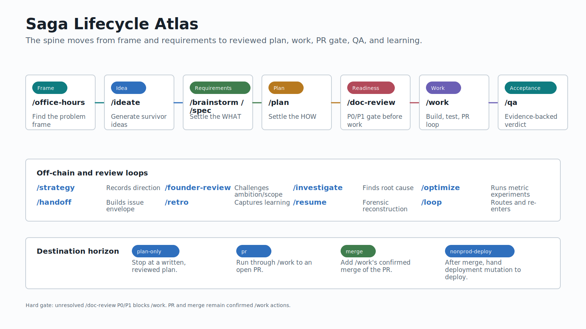

# Saga Lifecycle

Saga routes a work thread from early framing to reviewed work, PR/merge coordination, QA evidence, handoff, and learning.

## Main Chain

The main chain is designed around readiness gates.

| Stage | Owner | Output | Gate |
|-------|-------|--------|------|
| Idea or requirements ready | `/plan` | `docs/plans/` | WHAT must be settled enough to plan HOW |
| Plan ready | `/doc-review` | `docs/reviews/` | unresolved P0/P1 blocks `/work` |
| Reviewed plan | `/work` | work session, commits, PR | tests and fresh code review |
| PR boundary | `/code-review` | `docs/code-reviews/` | unresolved P0/P1 blocks PR-ready |
| Merged or acceptance boundary | `/qa` | `docs/qa/` | verdict: ship, ship-with-deferred, or no-ship |
| Complete or routed follow-up | `/handoff` or `/retro` | issue envelope or learning | owner-specific review |

`/loop` can route into this chain, but it does not own the phase work. The routed command owns its phase, gates, and backend choice.

## Off-Chain Commands

Off-chain commands are deliberate exits from the linear path.

| Command | State behavior | Routes back through |
|---------|----------------|---------------------|
| `/spec` | saga-untouched | `/handoff`, `/plan`, optional `/doc-review` |
| `/investigate` | saga read-only | `/work`, `/handoff`, `/brainstorm`, `/code-review` |
| `/optimize` | saga-untouched | `/work` for the winning change |
| `/strategy` | saga-untouched | `/ideate`, `/brainstorm`, `/plan`, `/founder-review` |
| `/retro` | saga read-only terminal | `/handoff` only when learning should become work |

Do not add off-chain commands as stored `lifecycle_phase` values. Their artifacts can still become handoff sources.

## Destination Horizon

Destination controls how far the lifecycle should drive.

| Destination | Horizon |
|-------------|---------|
| `plan-only` | stop after a written and reviewed plan |
| `pr` | run through `/work` to an open PR |
| `merge` | add `/work`'s confirmed PR merge |
| `nonprod-deploy` | after merge, route deployment mutation to `deploy` |

`deploy` owns deployment mutation. Saga records deployment intent but does not promote tags or mutate environments.

## Gates

The hard readiness gate before implementation is `/doc-review`: unresolved P0/P1 findings block `/work` unless the operator records an override.

The hard PR gate belongs to `/work` through programmatic `/code-review`: unresolved P0/P1 findings or a stale review block PR-ready unless explicitly overridden with a recorded rationale.

QA is acceptance evidence. It can route repairs, defects, investigation, handoff, or retro, but it does not fix bugs or deploy.
