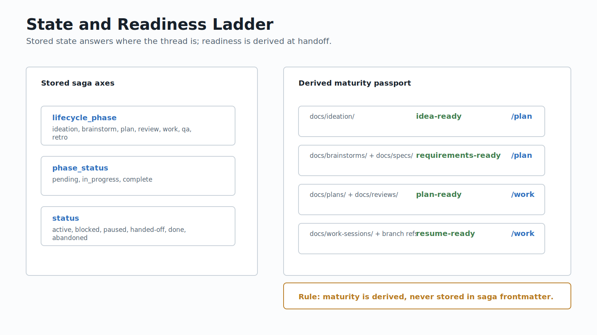

# Saga State And Readiness

Saga has three stored state axes. Handoff readiness is derived from those axes or artifact paths, and is never stored as saga frontmatter.

## Stored State

Stored saga ticks live under git-ignored `.gemini/saga/`. The append-only tick log is local state; committed docs, git, issues, PRs, and deployment systems remain their own authorities.

| Axis | Values | Purpose |
|------|--------|---------| 
| `lifecycle_phase` | `ideation`, `brainstorm`, `plan`, `review`, `work`, `qa`, `retro` | where the work thread is in the lifecycle |
| `phase_status` | `pending`, `in_progress`, `complete` | whether the current numeric phase is done |
| `status` | `active`, `blocked`, `paused`, `handed-off`, `done`, `abandoned` | disposition of the whole thread |

`status` must not use `pending` or `in_progress`; those belong to `phase_status`.

## Derived Maturity

`maturity` is a handoff passport. It is computed when Saga prepares a handoff, not stored in a saga tick.

| Source | Derived maturity | Consumed by |
|--------|------------------|-------------|
| `docs/ideation/` | `idea-ready` | `/plan` |
| `docs/brainstorms/` | `requirements-ready` | `/plan` |
| `docs/specs/` | `requirements-ready` | `/plan` or `/handoff` |
| `docs/plans/` | `plan-ready` | `/work` |
| `docs/reviews/` | `plan-ready` | `/work` |
| `docs/work-sessions/` | `resume-ready` | `/work` |
| branch refs | `resume-ready` | `/work` |

The `/spec` case is the most important trap: `docs/specs/` is `requirements-ready`, but `spec` is not a stored lifecycle phase.

## Consumer Rules

`/plan` consumes `idea-ready` and `requirements-ready` context. Its job is to settle HOW and write `docs/plans/`.

`/work` consumes `plan-ready` and `resume-ready` context. Its job is to execute a reviewed plan or re-enter an active work thread.

`/handoff` prepares the envelope and routes to `mission-control`; it does not own the issue body or GitHub mutation.
