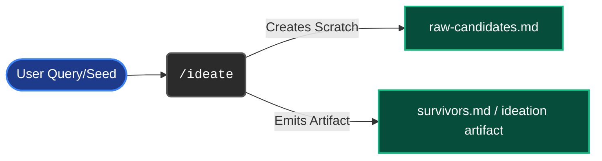
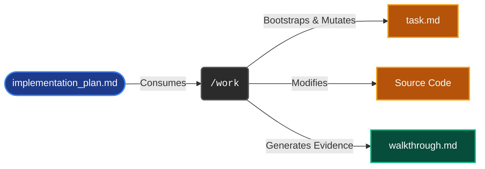
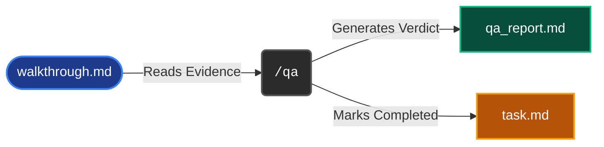

# Orchestration Command Dry-Runs

This document provides visual "dry-runs" for the major Saga orchestration commands. Because Saga operates without explicit `.claude/` checkpoints, executing commands mutates the native `brain/` state directly. Use these diagrams to understand exactly what will be consumed, updated, or created *before* you execute a command to eliminate execution anxiety.

## `/ideate`
**Purpose:** Generate, critique, and surface surviving grounded Infiquetra ideas.
**Brain State Impact:** Creates the ideation artifact and the raw candidates pool.

## `/brainstorm`
**Purpose:** Deep-dive one chosen idea into a right-sized requirements document.
**Brain State Impact:** Takes the ideation survivor or raw user request and generates a formal requirements file.

## `/plan`
**Purpose:** Create durable implementation plans with issue, review, test, and deploy gates.
**Brain State Impact:** The critical gateway. Creates the native Antigravity `implementation_plan.md`.

## `/work`
**Purpose:** Execute an approved plan to PR-ready.
**Brain State Impact:** Parses the approved plan, builds the `task.md` checklist, mutates source code, and writes the final `walkthrough.md`.

## `/qa`
**Purpose:** Run a risk-driven acceptance-evidence QA gate.
**Brain State Impact:** Consumes the walkthrough and mutates the status tracking to approved or rejected.

## `/retro`
**Purpose:** Meta-improvement engine. Terminal advisory phase.
**Brain State Impact:** Reads everything and appends to the Engineering Journal.

